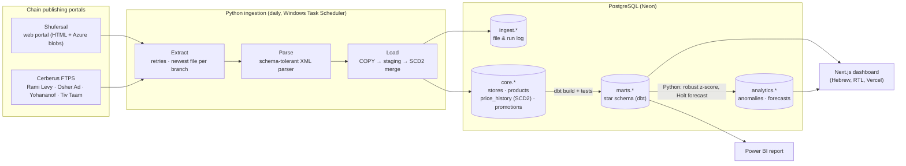

# Israel Grocery Price Tracker

End-to-end data platform that collects the daily price files Israeli supermarket
chains must publish under the **Price Transparency Law (2014)**, stores full price
history, and answers: *which chain and which branch is cheapest, how fast are
prices rising, and what's next?*

**Live dashboard:** [grocery-price-tracker-2lo2.vercel.app](https://grocery-price-tracker-2lo2.vercel.app) · **Stack:** Python · PostgreSQL (Neon) · dbt · Next.js · Power BI · GitHub Actions

---

## Architecture



## What makes it interesting

| Problem | Solution |
|---|---|
| Every chain publishes a slightly different format: `<Item>` vs `<Line>`, `STOREID` vs `StoreId`, UTF‑8 / UTF‑16 / Windows‑1255, ZIP files named `.gz`, truncated uploads, even typos (`blsWeighted`) | One **shape-based parser** (`src/pricetracker/parsing`) that matches elements by structure and case-insensitive tag names, with tolerant decoding and recovery of truncated gzip streams. Tested on real chain files. |
| A full price file is ~10k rows per branch per day — storing every snapshot doesn't fit a free database | **SCD Type 2 price history**: a row is written only when a price changes; closed rows get `valid_to`; items missing from a full snapshot are closed as delisted. On the synthetic test set, 31,800 staged rows became 1,319 stored rows (‑96%). |
| Re-runs, late files, half-empty files | **Idempotent ingestion** (`ingest.file_log`), out-of-order guard (an older snapshot is refused), and a safety valve so a truncated "full" file can't wipe a branch's shelf. |
| "2 for ₪10" is reported as a bundle total by some chains and as a unit price by others | Promo prices are normalised to a **per-unit effective price** with a documented rule; loyalty-club deals are kept separate. |
| Comparing chains fairly | A **common basket** of shared barcodes and a **Jevons price index** (geometric mean of price relatives, the CBS method for elementary aggregates). Basket cost is computed only over products every chain sold that day. |
| Data quality | dbt tests (uniqueness, relationships, accepted values) plus custom tests: no overlapping SCD2 periods, effective ≤ regular price, index starts at 100. **Robust z-score (median/MAD)** flags suspicious prices across branches. |
| Forecasting honestly | Damped-trend **Holt exponential smoothing** (numpy, grid-searched), evaluated with a **rolling-origin backtest against a naive baseline**. Results are stored, including when the model doesn't beat naive. |

## Data model

`core` (written by Python) → `marts` (built by dbt):

- **Dimensions:** `dim_chain`, `dim_store`, `dim_product` (category inferred from Hebrew keyword rules, `seeds/category_keywords.csv`), `dim_date`
- **Facts:** `fct_current_price` (branch × product today, with best active promo), `fct_price_changes` (one row per change), `fct_price_history` (view)
- **Marts:** `mart_basket_index_daily`, `mart_product_chain_price`, `mart_store_basket`, `mart_chain_summary`, `mart_daily_changes`, `mart_pipeline_health`

## Quick start

```bash
python -m venv .venv && source .venv/bin/activate      # Windows: scripts\setup.ps1
pip install -r requirements.txt && pip install -e . --no-deps
cp .env.example .env                                   # paste your DATABASE_URL

python -m pricetracker migrate                         # create schemas
python -m pricetracker run --chain shufersal           # ingest one chain
python -m pricetracker daily                           # all chains + dbt build + analytics
```

Other commands: `load <files|dir>` (offline files), `dbt <args>` (dbt with credentials from `.env`), `analytics`, `cleanup`, `chains`.

**Develop without waiting for history:** `python scripts/generate_demo_data.py` writes 45 days of *synthetic* files for all five chains (fake barcodes starting `7299999`). Load them into a **separate dev database** only.

Which branches are tracked is set in `config/settings.yaml` (default: northern Israel, 6 branches per chain, sized for a 0.5 GB free database).

Web dashboard: see `web/` (`npm install && npm run dev`). Power BI: see `powerbi/README.md`.

## Testing

```bash
pytest                                   # parser, sources, analytics (no DB needed)
TEST_DATABASE_URL=postgresql://... pytest tests/test_scd2_integration.py   # real Postgres
```

CI (GitHub Actions) runs the tests against Postgres 16, loads the synthetic data, runs `dbt build` (models + data tests) and the analytics jobs, then type-checks and builds the web app.

## Project layout

```
src/pricetracker/
  sources/      Shufersal (HTTP) and Cerberus (FTPS) extractors
  parsing/      decoding + schema-tolerant XML parser
  db/           migrations runner, SCD2 loader
  analytics/    anomaly detection, index forecasting
  pipeline.py   orchestration, store selection, raw-file retention
sql/migrations/ schema (ingest, core, analytics) + read-only web role
dbt/            staging → intermediate → marts, tests, seeds
web/            Next.js dashboard (server-side queries, read-only role)
powerbi/        model guide + DAX measures
scripts/        Windows setup/scheduler, demo data generator
tests/          unit + integration tests, real chain sample files
```

## Why ingestion runs on my machine

Several chain portals reject non-Israeli IP ranges, so cloud runners (GitHub Actions, Vercel) can't download the files reliably. Ingestion runs on a Windows scheduled task; everything downstream is in the cloud.

## Roadmap

- More chains (Victory, Yeinot Bitan, Hazi Hinam) via the same source interface
- Product matching for items without a shared barcode (fuzzy name + size)
- Promotion-probability model once a few months of promo history exist

## Data & credits

Price data © the respective chains, published under the Israeli Price Transparency Law.
Portal endpoints and public FTP usernames were cross-checked against Sefi Erlich's
[israeli-supermarket-scarpers](https://github.com/OpenIsraeliSupermarkets/israeli-supermarket-scarpers);
no code was copied. Two sample files in `tests/fixtures` come from Sefi Erlich's repositories
(trimmed, see `tests/fixtures/README.md`) and are used here non-commercially under their license.
